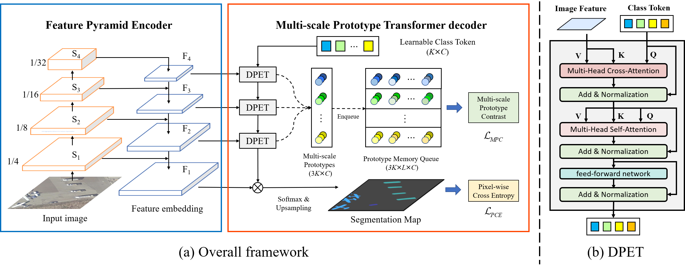

<div align="center">
  
  <div>&nbsp;</div>
  <div align="center">
    <b><font size="5">OpenMMLab website</font></b>
    <sup>
      <a href="https://openmmlab.com">
        <i><font size="4">HOT</font></i>
      </a>
    </sup>
    &nbsp;&nbsp;&nbsp;&nbsp;
    <b><font size="5">OpenMMLab platform</font></b>
    <sup>
      <a href="https://platform.openmmlab.com">
        <i><font size="4">TRY IT OUT</font></i>
      </a>
    </sup>
  </div>
  <div>&nbsp;</div>
</div>
<br />

[](https://pypi.org/project/mmsegmentation/)
[](https://pypi.org/project/mmsegmentation)
[](https://mmsegmentation.readthedocs.io/en/latest/)
[](https://github.com/open-mmlab/mmsegmentation/actions)
[](https://codecov.io/gh/open-mmlab/mmsegmentation)
[](https://github.com/open-mmlab/mmsegmentation/blob/master/LICENSE)
[](https://github.com/open-mmlab/mmsegmentation/issues)
[](https://github.com/open-mmlab/mmsegmentation/issues)

Documentation: https://mmsegmentation.readthedocs.io/

English | [简体中文](README_zh-CN.md)

## Introduction

This is the implementation for Multi-scale Prototype Contrast Network. 



The trained model for iSAID can be found at the [BaiduYun](https://pan.baidu.com/s/1gsoru9czjvu0PO0kSZq06g) (password: cbn0), corresponding config is configs/mpcnet/mpc_swin_isaid.py.

### Major features

- **Unified Benchmark**

  We provide a unified benchmark toolbox for various semantic segmentation methods. This code is developed based on mmsegemetnation. 

- **Modular Design**

  We decompose the semantic segmentation framework into different components and one can easily construct a customized semantic segmentation framework by combining different modules.


## Datasets preparation:

- [x] [Potsdam](https://github.com/open-mmlab/mmsegmentation/blob/master/docs/en/dataset_prepare.md#isprs-potsdam)
- [x] [Vaihingen](https://github.com/open-mmlab/mmsegmentation/blob/master/docs/en/dataset_prepare.md#isprs-vaihingen)
- [x] [iSAID](https://github.com/open-mmlab/mmsegmentation/blob/master/docs/en/dataset_prepare.md#isaid)

## Installation

Please refer to [get_started.md](docs/en/get_started.md#installation) for installation and [dataset_prepare.md](docs/en/dataset_prepare.md#prepare-datasets) for dataset preparation.

## Get Started

Please see [train.md](docs/en/train.md) and [inference.md](docs/en/inference.md) for the basic usage of MMSegmentation.
There are also tutorials for [customizing dataset](docs/en/tutorials/customize_datasets.md), [designing data pipeline](docs/en/tutorials/data_pipeline.md), [customizing modules](docs/en/tutorials/customize_models.md), and [customizing runtime](docs/en/tutorials/customize_runtime.md).
We also provide many [training tricks](docs/en/tutorials/training_tricks.md) for better training and [useful tools](docs/en/useful_tools.md) for deployment.

A Colab tutorial is also provided. You may preview the notebook [here](demo/MMSegmentation_Tutorial.ipynb) or directly [run](https://colab.research.google.com/github/open-mmlab/mmsegmentation/blob/master/demo/MMSegmentation_Tutorial.ipynb) on Colab.

Please refer to [FAQ](docs/en/faq.md) for frequently asked questions.

## Citation

If you find this project useful in your research, please consider cite:

```bibtex
@misc{mmseg2020,
    title={{MMSegmentation}: OpenMMLab Semantic Segmentation Toolbox and Benchmark},
    author={MMSegmentation Contributors},
    howpublished = {\url{https://github.com/open-mmlab/mmsegmentation}},
    year={2020}

}
```

## Contributing

We appreciate all contributions to improve MMSegmentation. Please refer to [CONTRIBUTING.md](.github/CONTRIBUTING.md) for the contributing guideline.

## Acknowledgement

MMSegmentation is an open source project that welcome any contribution and feedback.
We wish that the toolbox and benchmark could serve the growing research
community by providing a flexible as well as standardized toolkit to reimplement existing methods
and develop their own new semantic segmentation methods.